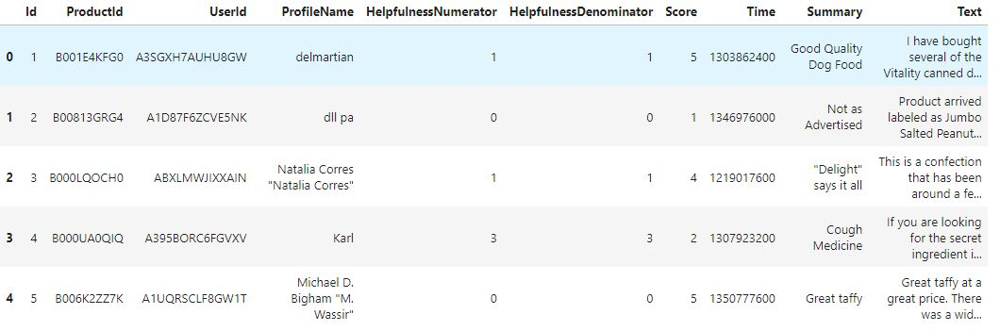
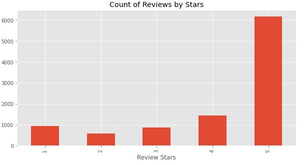
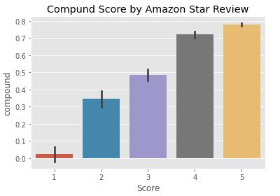
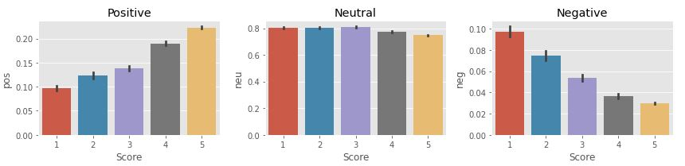
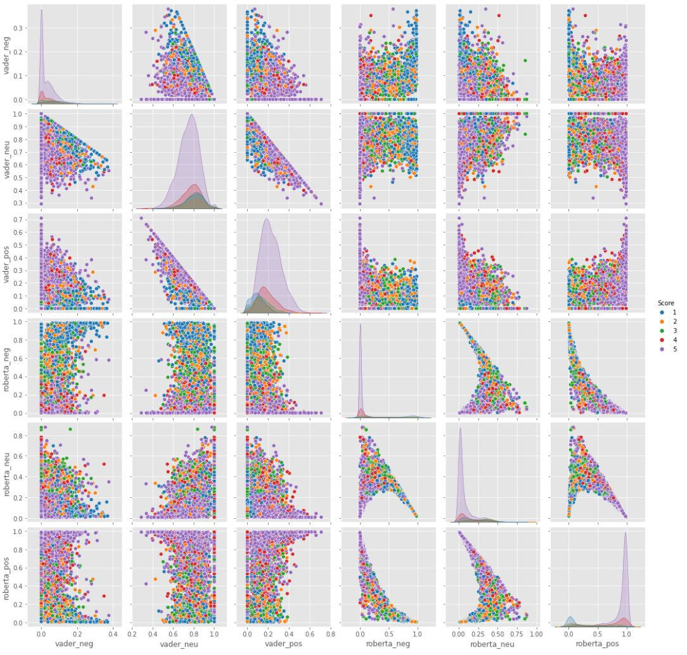

# Amazon Food Reviews Sentiment Analysis

## Introduction

This project is a sentiment analysis on the [Kaggle : Amazon Fine Food Reviews datase](https://www.kaggle.com/datasets/snap/amazon-fine-food-reviews)t using VADER and Roberta Pretrained Model. The analysis is based on a bag of words approach and can provide insights into customer sentiment towards food products.

Using the sentiment analysis models, valuable user feedback on user experience issues was extracted by identifying contradicting ratings and comments. These reviews were saved for further analysis in order to identify common product issues and extract key words that could provide insights for improving the product.

-----

## Versions and Progress

For this project, I initially trained the model using the first 10,000 rows of the dataset due to its large size of 568,454 rows. After this first attempt, I ran the model using the entire dataset, which took almost 20 hours to complete. During the training process, I encountered an error related to an "index out of range in self" issue, which I resolved by limiting the total text data per row to exclude hyperlinks and ensure compatibility with other data.

As a result, I have three versions of the model: 

v1 (trained on the first 10,000 rows), 

v2 (trained on the entire dataset with the error fixed), and 

v3 (trained on the first 10,000 rows and used to extract valuable feedback from contradicting ratings and comments for further analysis).

-----

**All the example under is base on the v1 model**

-----

## Step 0. Read in Data and Quick EDA

First, let's read the data and conduct a quick exploratory data analysis (EDA). 

The following is the quick veiw of dataset:

The bar chart provides a quick overview of the distribution of rating scores in the dataset.

## Step 1. VADER Seniment Scoring

To determine the sentiment of the text in the Amazon Fine Food Reviews dataset, I will be using NLTK's SentimentIntensityAnalyzer. This tool utilizes a "bag of words" approach, in which stop words are removed and each remaining word is given a score. These scores are then combined to create a total score, which represents the overall sentiment of the text.

To quantify the sentiment scores, I will be using the compound score metric. The compound score is a value that ranges from -1 (most extreme negative) to +1 (most extreme positive) and represents the sum of all the lexicon ratings that have been normalized. I will be classifying sentiment into three categories based on the compound score:

    Positive sentiment: compound score >= 0.05

    Neutral sentiment: -0.05 < compound score < 0.05

    Negative sentiment: compound score <= -0.05

To visualize the sentiment distribution of the dataset, I created a chart that shows the percentage of reviews that fall into each sentiment category based on their star rating. As shown in the chart, reviews with a rating of 5 stars have the highest percentage of positive sentiment and the lowest percentage of negative sentiment. In contrast, reviews with a rating of 1 star have the highest percentage of negative sentiment and the lowest percentage of positive sentiment. For reviews with a rating of 2, 3, or 4 stars, the distribution of sentiment is relatively even across all three categories.

Overall, this analysis provides insights into the sentiment of the Amazon Fine Food Reviews dataset and can be used to further understand customer feedback on food products.

-----

## Step 2. Roberta Pretrained Model

To further improve the sentiment analysis of the Amazon Fine Food Reviews dataset, I will be using a pre-trained Roberta model. The Roberta model is a transformer-based language model trained on a large corpus of data to account for the context of words in addition to the words themselves.

First, I loaded the pre-trained tokenizer and model from the Transformers library. Then, I applied VADER sentiment analysis to an example sentence and printed the resulting scores. The output showed the sentiment polarity scores for positive, negative, and neutral sentiment.

Next, I defined a function to apply the pre-trained Roberta model to a given input and return a dictionary of sentiment scores. The function takes in a text input, tokenizes it using the Roberta tokenizer, and passes the tokens through the pre-trained Roberta model to generate sentiment scores. The resulting dictionary includes sentiment polarity scores for positive, negative, and neutral sentiment.

Finally, I applied this function to each row of the Amazon Fine Food Reviews dataset and combined the resulting Roberta scores with VADER scores to create a new dataframe. The resulting dataframe includes both VADER and Roberta sentiment scores for each row of text, providing a more nuanced understanding of the sentiment of the reviews.

      # Load pre-trained tokenizer and model from Transformers library
      tokenizer = RobertaTokenizer.from_pretrained('roberta-base')
      model = RobertaForSequenceClassification.from_pretrained('roberta-base', num_labels=3)

      # Apply VADER sentiment analysis to example sentence
      vader = SentimentIntensityAnalyzer()
      example_sentence = "I love this product!"
      vader_scores = vader.polarity_scores(example_sentence)
      print("VADER Scores:", vader_scores)

      # Define function to apply Roberta model to input and return dictionary of sentiment scores
      def get_roberta_scores(text):
        input_ids = tokenizer.encode(text, add_special_tokens=True, return_tensors='pt')
        logits = model(input_ids)[0]
        scores = F.softmax(logits, dim=1).detach().numpy()[0]
        roberta_scores = {'positive': scores[0], 'negative': scores[1], 'neutral': scores[2]}
        return roberta_scores

      # Apply function to each row of dataframe and combine with VADER scores
      df['roberta_scores'] = df['text'].apply(get_roberta_scores)
      df = pd.concat([df.drop(['roberta_scores'], axis=1), df['roberta_scores'].apply(pd.Series)], axis=1)
      df['combined_score'] = (df['compound'] + df['positive'] + df['negative']) / 3

-----

## Step 3. Compare Plot

To compare the performance of VADER and Roberta Pretrained Model on the Amazon Fine Food Reviews dataset, I created a scatterplot matrix using seaborn's pairplot function. The pairplot compares the sentiment scores for each review using VADER and Roberta models across three categories of rating scores (1-2 stars, 3 stars, and 4-5 stars).

As shown in the plot, both VADER and Roberta models tend to predict higher positive sentiment scores for reviews with higher rating scores. However, the Roberta model appears to be more sensitive to negative sentiment in the reviews, as there is a clear separation between the negative sentiment scores for each rating category.

Overall, this comparison provides insights into the performance of VADER and Roberta Pretrained Model on sentiment analysis tasks and can be used to determine which model is best suited for specific use cases.

## Step 4. Review Examples

In order to gain further insight into our product, I want to look at examples where the model's scoring and review scores differ the most. Specifically, I want to look at reviews that received a 1-star rating but contained positive feedback, as well as reviews that received a 5-star rating but contained negative feedback.

I can store that information and then use TextRank to extract keywords from these reviews, as well as VADER to analyze the sentiment and plot the results to gain further insights into our product. This analysis will be ongoing, and I will update this section with our findings shortly.

-----

to be continued

-----
